# Part 2: Horizon Detection

## A description of how you formulated the search problem
The problem has 3 subparts in it. First part focuses on using a very simple bayes net to get air-ice and ice-rock boundaries. As per the bayes net for part 1, we just found the maximum value of edge strength for each column. The results from simple bayes were bad and the points were scattered around on the image. To improve upon this, we used a Hidden Markov Model as suggested in part2. We used viterbi algorithm to solve maximum a posteriori estimate. For Viterbi, we need initial, emission and transition probabilities. We calculated initial probabilities from edge strength of first column. For emission probabilities, we divided edge strength with original pixels. For transition probabilities, we considered cost of moving from row of one column to row of the next column. The transitions to the nearest row from the current row will have the lowest cost and the transition to the farthest row will have the highest cost. Using this algorithm, we got better results than bayes. For part3, we incorporate human feedback to improve our viterbi logic. Here we have a point that already belongs on the boundary. For this part, we used viterbi in two directions, from point to the left of the point till we reach the first column and from point to right of point till be reach the last column. This approach gives the best results for all images.

## A brief description of how your program works
For the first part of the problem, we just find the maximum edge strength of each column. For the second part, we use Hidden Markov model to find better boundaries than in part1. We use Viterbi algorithm for this. The code traverses through each column and computes sum of previous state cost with transition cost from previous to current state. We use dynamic programming to store the row number with minimum cost of the previous column.  For part3, the coordinated given by user are fed into viterbi algorithm which performs a bi-directional search to find the most probable point for each column. We set the exact pixel of human input as -np.log(1), while we give the other points on the same column a cost of Infinity. 

## Problems faced, assumptions, simplifications and design decisions
One design decision problem we had to make was about transition probabilities. We modelled transition probability based on distance from the current row. So, as distance increases, probability decreases. We compute transition probabilities based on two functions. If, the distance between current row and the previous row is less than or equal to 6 (11 pixels of the other column), than we calculate cost using -np.log(1|(dist+1)). If the distance is >6, we calculate the cost as -np.log((1|(2^(dist+1)))^2). So, we linearly decrease the probability for 11 nearby rows and then we jump to an exponential decrease in probability. For emission probabilities, we divided edge strength with image's raw pixels and then normaised the values. We also tried using only edge strength normalised over sum of edge strength for each column. Both yeild similar looking boundaries. 

## Experiments with transition and emission probabilities
For transition probabilities, we tried using some other approaches apart from the one mentioned above. We experimented with using only a linear decrease in probability like 1|(dist+1). But this yeilded in very poor boundary choices as it won't penalise farther away states too much. We also tried increasing the power of dist by 1.2, 1.4, 1.6 ,.... so the probabilities would look like, 1|(dist^1+1), 1|(dist^1.2+1), 
1|(dist^1.4+1), 1|(dist^1.4+1), ... but the effort was too much to find a proper interval range for each of the probability and so we decided on using the one discussed in the above section.

## Example outputs 

### Image 09

Air Ice Bayes:

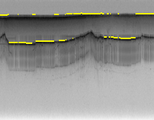

Ice Rock Bayes:

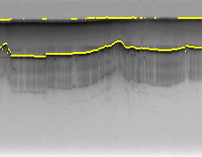

Air Ice HMM:

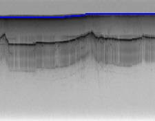

Ice Rock HMM:

Air Ice Human:

Ice Rock Human:

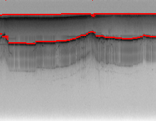

### Image 16 

Air Ice Bayes:

Ice Rock Bayes:

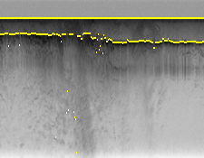

Air Ice HMM:

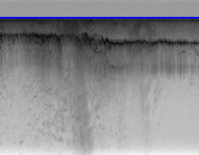

Ice Rock HMM:

Air Ice Human:

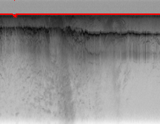

Ice Rock Human:

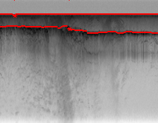

### Image 23

Air Ice Bayes:

Ice Rock Bayes:

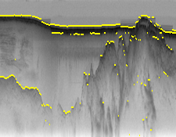

Air Ice HMM:

Ice Rock HMM:

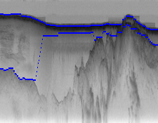

Air Ice Human:

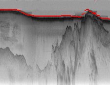

Ice Rock Human:

