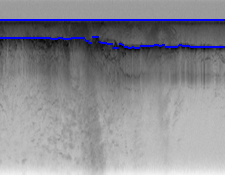

# Part 2: Horizon Detection

## A description of how you formulated the search problem
The problem has 3 subparts in it. First part focuses on using a very simple bayes net to get air-ice and ice-rock boundaries. As per the bayes net for part 1, we just found the maximum value of edge strength for each column. The results from simple bayes were bad and the points were scattered around on the image. To improve upon this, we used a Hidden Markov Model as suggested in part2. We used viterbi algorithm to solve maximum a posteriori estimate. For Viterbi, we need initial, emission and transition probabilities. We calculated initial probabilities from edge strength of first column. For emission probabilities, we divided edge strength with original pixels. For transition probabilities, we considered cost of moving from row of one column to row of the next column. The transitions to the nearest row from the current row will have the lowest cost and the transition to the farthest row will have the highest cost. Using this algorithm, we got better results than bayes. For part3, we incorporate human feedback to improve our viterbi logic. Here we have a point that already belongs on the boundary. For this part, we used viterbi in two directions, from point to the left of the point till we reach the first column and from point to right of point till be reach the last column. This approach gives the best results for all images.

## A brief description of how your program works
For the first part of the problem, we just find the maximum edge strength of each column. For the second part, we use Hidden Markov model to find better boundaries than in part1. We use Viterbi algorithm for this. The code traverses through each column and computes sum of previous state cost with transition cost from previous to current state. We use dynamic programming to store the row number with minimum cost of the previous column.  For part3, the coordinated given by user are fed into viterbi algorithm which performs a bi-directional search to find the most probable point for each column. We set the exact pixel of human input as -np.log(1), while we give the other points on the same column a cost of Infinity. 

## Problems faced, assumptions, simplifications and design decisions
One design decision problem we had to make was about transition probabilities. We modelled transition probability based on distance from the current row. So, as distance increases, probability decreases. We compute transition probabilities based on two functions. If, the distance between current row and the previous row is less than or equal to 6 (11 pixels of the other column), than we calculate cost using -np.log(1|(dist+1)). If the distance is >6, we calculate the cost as -np.log((1|(2^(dist+1)))^2). So, we linearly decrease the probability for 11 nearby rows and then we jump to an exponential decrease in probability. For emission probabilities, we divided edge strength with image's raw pixels and then normaised the values. We also tried using only edge strength normalised over sum of edge strength for each column. Both yeild similar looking boundaries. 

## Experiments with transition and emission probabilities
For transition probabilities, we tried using some other approaches apart from the one mentioned above. We experimented with using only a linear decrease in probability like 1|(dist+1). But this yeilded in very poor boundary choices as it won't penalise farther away states too much. We also tried increasing the power of dist by 1.2, 1.4, 1.6 ,.... so the probabilities would look like, 1|(dist^1+1), 1|(dist^1.2+1), 
1|(dist^1.4+1), 1|(dist^1.4+1), ... but the effort was too much to find a proper interval range for each of the probability and so we decided on using the one discussed in the above section.

## Example outputs 

### Image 09

Air Ice Bayes:

Ice Rock Bayes:

Air Ice HMM:

Ice Rock HMM:

Air Ice Human:

Ice Rock Human:

### Image 16 

Air Ice Bayes:

Ice Rock Bayes:

Air Ice HMM:

Ice Rock HMM:

Air Ice Human:

Ice Rock Human:

### Image 23

Air Ice Bayes:

Ice Rock Bayes:

Air Ice HMM:

Ice Rock HMM:

Air Ice Human:

Ice Rock Human:

# Part 3: Optical Character Recognition

## A description of how you formulated the search problem
This problem has two subparts: First part where we are asked to implement OCR using bayes algorithm and the second part where we are asked to implement OCR using Viterbi Algorithm. For the bayes, we used only emission probability to calculate the maximum values from all possible outcomes, comparing all 72 outcomes. Though the result was great, it was struggling in some cases where there was too much noise in the image. In the second part we implemented Viterbi Algorithm and we took the max value of Emission, Transition and Initial Probabilities and the results were slighly better as transition probability was allowing the algorithm to pick the most common sequences of letters.

### Emission Probability
Emission probability was calculated by comparing each and every pixel and checking number of pixels where there was "*" in trainining data and in test letters and checking number of pixels where the pixel was " " in both train and test letters. Then, we decided to give more priority to former and after trying some possible combinations of values, we finally finalized to choose 0.9 where "*" matched and 0.1 where "blank" matched. We stored all values in a dictionary and stored it using index values as keys.
The count was calculated this way and then we calculated probability using modified laplace smoothing. I had to add 1 in numerator because some values were remaining zero.

### Transition Probability
Transition Probability was calcualted by iterating over the whole text string starting from the 1st letter as we would be checking the letter before that to compute the count of the current letter occuring after the previous letter. From this, we calculated the probability using Laplace smoothing.

### Initial Probability
Initial count was calculated by taking the count of the first letter from each sentence from "bc.train" file. From this, the initial probability was calculated by Laplace smoothing.

## A brief description of how your program works
For the bayes algorithm, we simply calculated the emission probability and returned the max values for each letter. For the Viterbi Algorithm, we calculated Emission, Initial and Transition probability and we took log of them and took sum because `log(a*b) = log(a) + log(b)`. The reason why we took log was because the values were underflowing as we iterated over few letter/observed states. Then we created two matrices: one to store the probabiliy and second to store the path which would help us to backtrack and calculate the maximum cost path. In probability matrix, we stored the `max` values and in the backtrack matrix, we stored index of the path that we chose for the best path using `argmax`. In Viterbi, for the first letter, we only used Emission and Initial Probabiliy and stored the values inside the probability matrix and for the backtrack matrix, we just stored the hidden state/letter as it is the first letter of the sentence. For the rest of the letters, we used all three probabilities to calculate the maximum value. Once iteration was over, we backtracked from the last letter/observed state to the first letter to find the optimal math. 

## Problems faced, assumptions, simplifications and design decisions
The major decision we had to make was optimizing the viterbi algorithm as results we were getting were not good especially when there was a noisy image. Also, the training set we used was `bc.train` and the transition probability was sometimes messing up the result and giving dump values. So we had to make a decision to multiply the value that we get from the transition probability with 0.01 as that would make it significance less and it was surprisingly giving me good results and improving the result that we got from bayes. The same thing was happening with initial probabilities as well as some letter were correctly selected in bayes but in viterbi, it slighly relied on initial probabilities more. Especially for letter such as "T","I",etc. So we had to multiply it with the 0.01 value to make its value less significant. We believe it is because we are using laplace smoothing, it would bring values closer to each other. 

